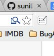

## Form Filler

You know how annoying it is to fill fields like username, passwords, email id etc again and again on webpages in you daily work? Well, this chrome extension solves this problem by allowing you to save these information once and access them by just right clicking on an input field which you want to fill.

To try out this extension, follow the below steps :
 * Clone/download this repo.
 * Follow the steps [here](https://developer.chrome.com/extensions/getstarted#unpacked) to install the extension
    into your browser.
 * After installing the extension, you can click on the small icon that appears as below next to the Omnibox in Chrome browser and
    add the information to the chrome local storage.

 * You can access these information by right clicking on any input field on any page on THE INTERNET!
